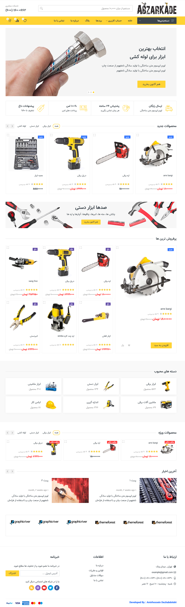

<h1 align="center">
    <a href=""> Online Shopping  by Django</a>
</h1>

<p align="center">
  <i align="center">
    This is an Ecommerce websites that help you sell and represent your products  🚀</i>
</p>


## Introduction
This is my first real project with `django` and i had many challenges to make this. django is very simple and nice framework i have ever seen.
beause its powered and developed with `python` and i love python too.
Actually, i just developed a backend side of this website and frontend side of it is pre-created and i just downloaded.
everything that a Ecommerce website needed is available in the following website and can used by everyone who wants to start or have small shopping.
Enjoy it. :)


<details open>
<summary>
 Features
</summary> <br />


<table>
  <tr>
    <td rowspan="3"></td>
    <td rowspan="3"></td>
  </tr>
  <tr>
  </tr>
  <tr>
  </tr>
</table>
    
</details>

## Installation
1. Follow the steps below to install app perfectly:
```shell
 > git clone https://github.com/Amirhoseindzh/django-online-shopping.git

 > virtualenv venv 

 > venv\scripts\activate 

(venv) > cd project_folder 

(venv) > pip install -r requirements.txt

(venv) > python manage.py runserver 

```

Now you can open a browser like chrome or etc and just go to url as <a href='http://localhost:8000/'>http://localhost:8000/

## Admin
If you want to login to admin page look below:
```login
username/email : admin
password : admin123456
```
## Resources

- **[YouTube](https://www.youtube.com/)** for guides.
- **[Google](https://www.google.com/)** for guides.
- **[Github](https://www.github.com/)** for guides.
- Chatgpt for guides.

<a name="contributing_anchor"></a>
## Contributing

`Django online shoping` is an open-source project. I committed to a fully transparent development process and highly appreciate any contributions. Whether you are helping me fix bugs, proposing new features, improving my documentation or spreading the word - we would love to have you as a part of the Airline-booking community. 

- Bug Report: If you see an error message or encounter an issue while using Amplication, please create a [bug report].


## License

A large part of this project is licensed under the [Apache 2.0](./LICENSE) license. 
